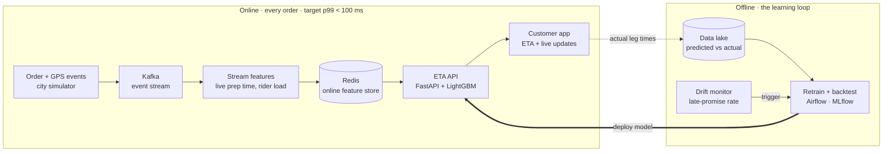

# Real-Time Delivery ETA

An end-to-end, real-time ETA prediction service for food and quick-commerce delivery, in the style of Swiggy, Zomato, Blinkit and Zepto.

A simulated city of orders, riders and kitchens streams events through Kafka. Streaming features feed quantile models served behind a low-latency API, and an offline loop monitors drift and retrains nightly.

> **Status: Week 1, building in public.** This README is the design. Code lands milestone by milestone below. Follow along or jump in.

---

## The problem: an ETA is a race, not one number

The rider and the kitchen work in parallel, and whichever finishes last sets the pickup time:

```
Delivery time = max(Assignment + First mile, Prep) + Last mile
```

| Leg | Meaning | Hard because |
|-----|---------|--------------|
| **O2A** | Order placed → rider assigned | Depends on live rider supply |
| **FM** | First mile: rider → restaurant | Traffic, rider location |
| **Prep** | Kitchen prepares the order | Least observable leg; kitchen load varies by hour |
| **LM** | Last mile: restaurant → customer | Distance, traffic, weather, building access |

The ETA shown at checkout is the least certain one, so the service re-predicts as each leg completes: at assignment, at pickup, and on GPS pings.

## Architecture



## Design principles

1. **Predict a range, not a point.** Late hurts trust far more than early. Quantile models produce a median to display and a high percentile to promise.
2. **Measure broken promises, not just average error.** Track the late-promise rate (actual > promised) alongside MAE.
3. **Re-predict at every leg.** Each stage uses inputs that only exist once the order reaches it.
4. **Latency is part of the model.** Features are precomputed in the stream and read from Redis; requests are batched where possible.

## Planned stack

| Layer | Choice |
|-------|--------|
| Simulation | Python city simulator (orders, riders, kitchens, traffic by hour) |
| Streaming | Kafka, Python stream processor |
| Feature store | Redis |
| Models | LightGBM quantile regression, one per leg |
| Serving | FastAPI |
| Orchestration | Airflow |
| Tracking | MLflow |
| Monitoring | Prediction vs actual logging, drift alerts |
| Packaging | Docker Compose, GitHub Actions CI |

## Roadmap

- [ ] **M1 · City simulator** generating realistic orders, riders, kitchens and leg timings
- [ ] **M2 · Event pipeline** from the simulator through Kafka into streaming features in Redis
- [ ] **M3 · Baseline models** per leg, with a rule-based baseline to beat
- [ ] **M4 · Quantile models** with backtesting on MAE and late-promise rate
- [ ] **M5 · ETA API** in FastAPI, re-predicting at each leg, with load tests for p99 latency
- [ ] **M6 · Learning loop** with drift monitoring, nightly retraining and model registry
- [ ] **M7 · Dashboard** showing live ETAs and model health
- [ ] **M8 · One-command setup** via `docker compose up`

## Contributing

Looking for 1–2 collaborators (backend, data engineering, or a dashboard) and feedback from anyone who has shipped logistics or ETA ML.

Open an issue to discuss an idea or pick up a milestone, or reach out on LinkedIn.

## References

- Swiggy Bytes engineering blog: the delivery-time decomposition and per-leg tracking ETA
- [Akka × Swiggy case study](https://akka.io/customer-stories/swiggy): batching to cut prediction latency at scale

## License

[MIT](LICENSE)
